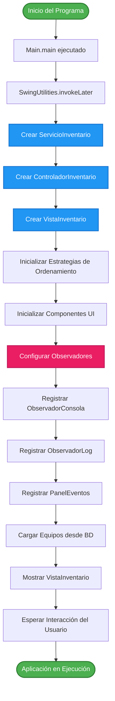
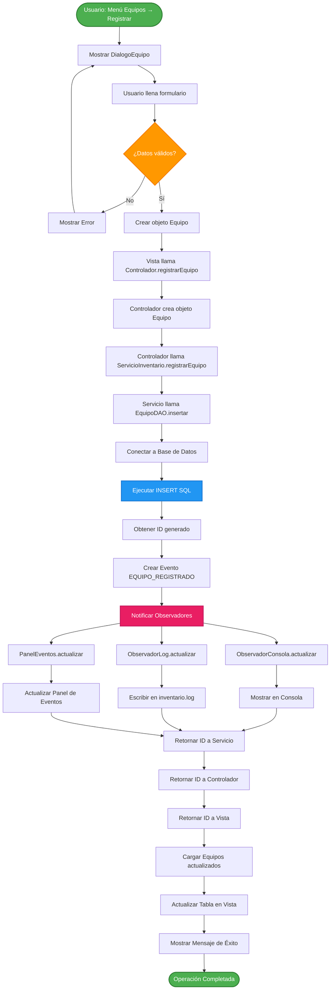
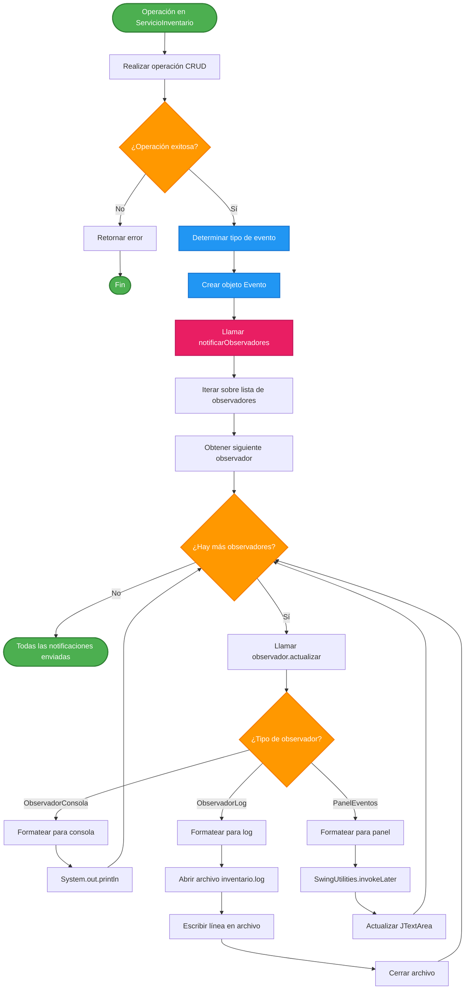
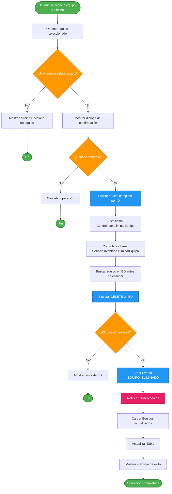

# Diagrama de Flujo del Programa - Sistema de Inventario

Este documento contiene el diagrama de flujo completo del sistema de inventario, mostrando los diferentes procesos y flujos de ejecución.

## 1. Diagrama de Flujo Principal - Inicialización

## 2. Diagrama de Flujo - Operación CRUD (Registrar Equipo)

## 3. Diagrama de Flujo - Cargar Equipos desde Archivo CSV

```mermaid
flowchart TD
    Start([Usuario: Menú Equipos → Cargar desde Archivo]) --> MostrarFileChooser[Mostrar JFileChooser]
    MostrarFileChooser --> UsuarioSelecciona{¿Usuario selecciona archivo?}
    UsuarioSelecciona -->|No| Cancelar[Cancelar Operación]
    Cancelar --> End1([Fin])
    UsuarioSelecciona -->|Sí| ObtenerRuta[Obtener ruta del archivo]
    ObtenerRuta --> LlamarControlador[Vista llama Controlador.cargarEquiposDesdeArchivo]
    LlamarControlador --> LlamarServicioArchivo[Controlador llama ServicioArchivo.cargarEquiposDesdeArchivo]
    LlamarServicioArchivo --> AbrirArchivo[Abrir archivo CSV]
    AbrirArchivo --> LeerLinea[Leer línea del archivo]
    LeerLinea --> EsEncabezado{¿Es encabezado?}
    EsEncabezado -->|Sí| LeerLinea
    EsEncabezado -->|No| ParsearCampos[Parsear campos CSV]
    ParsearCampos --> CrearEquipo[Crear objeto Equipo]
    CrearEquipo --> HayMasLineas{¿Hay más líneas?}
    HayMasLineas -->|Sí| LeerLinea
    HayMasLineas -->|No| ProcesarEquipos[Procesar lista de equipos]
    ProcesarEquipos --> IterarEquipo[Para cada equipo]
    IterarEquipo --> LlamarRegistrar[Llamar ServicioInventario.registrarEquipo]
    LlamarRegistrar --> InsertarBD[Insertar en Base de Datos]
    InsertarBD --> IncrementarContador[Incrementar contador]
    IncrementarContador --> HayMasEquipos{¿Hay más equipos?}
    HayMasEquipos -->|Sí| IterarEquipo
    HayMasEquipos -->|No| CrearEventoCarga[Crear Evento INVENTARIO_CARGADO]
    CrearEventoCarga --> NotificarObservadores[Notificar Observadores]
    NotificarObservadores --> RetornarCantidad[Retornar cantidad cargada]
    RetornarCantidad --> CargarEquipos[Cargar Equipos actualizados]
    CargarEquipos --> ActualizarTabla[Actualizar Tabla]
    ActualizarTabla --> MostrarMensaje[Mostrar mensaje con cantidad]
    MostrarMensaje --> End2([Operación Completada])
    
    style Start fill:#4CAF50,stroke:#2E7D32,stroke-width:2px,color:#fff
    style End1 fill:#4CAF50,stroke:#2E7D32,stroke-width:2px,color:#fff
    style End2 fill:#4CAF50,stroke:#2E7D32,stroke-width:2px,color:#fff
    style UsuarioSelecciona fill:#FF9800,stroke:#F57C00,stroke-width:2px,color:#fff
    style EsEncabezado fill:#FF9800,stroke:#F57C00,stroke-width:2px,color:#fff
    style HayMasLineas fill:#FF9800,stroke:#F57C00,stroke-width:2px,color:#fff
    style HayMasEquipos fill:#FF9800,stroke:#F57C00,stroke-width:2px,color:#fff
    style NotificarObservadores fill:#E91E63,stroke:#C2185B,stroke-width:2px,color:#fff
    style AbrirArchivo fill:#2196F3,stroke:#1976D2,stroke-width:2px,color:#fff
    style ParsearCampos fill:#2196F3,stroke:#1976D2,stroke-width:2px,color:#fff
    style InsertarBD fill:#2196F3,stroke:#1976D2,stroke-width:2px,color:#fff
    style CrearEventoCarga fill:#2196F3,stroke:#1976D2,stroke-width:2px,color:#fff
```

## 4. Diagrama de Flujo - Ordenamiento y Presentación

```mermaid
flowchart TD
    Start([Usuario cambia ordenamiento o presentación]) --> ObtenerSeleccion[Obtener selección del ComboBox]
    ObtenerSeleccion --> EsOrdenamiento{¿Es cambio de ordenamiento?}
    EsOrdenamiento -->|Sí| ActualizarEstrategias[Actualizar estrategias de ordenamiento]
    ActualizarEstrategias --> ObtenerMantenimientos[Obtener mantenimientos desde BD]
    ObtenerMantenimientos --> CrearEstrategia[Crear estrategia seleccionada]
    CrearEstrategia --> EstablecerEstrategia[Establecer estrategia en Controlador]
    EstablecerEstrategia --> CargarEquipos[Cargar Equipos]
    EsOrdenamiento -->|No| EsPresentacion{¿Es cambio de presentación?}
    EsPresentacion -->|Sí| ObtenerIndice[Obtener índice de presentación]
    ObtenerIndice --> EstablecerPresentacion[Establecer presentación en Controlador]
    EstablecerPresentacion --> CargarEquipos
    CargarEquipos --> LlamarControlador[Vista llama Controlador.obtenerEquipos]
    LlamarControlador --> ControladorLlamaServicio[Controlador llama ServicioInventario.listarEquipos]
    ControladorLlamaServicio --> ObtenerEquiposBD[Obtener equipos desde BD]
    ObtenerEquiposBD --> ObtenerMantenimientosBD[Obtener mantenimientos desde BD]
    ObtenerMantenimientosBD --> CalcularUltimoMant[Calcular último mantenimiento por equipo]
    CalcularUltimoMant --> RetornarLista[Retornar lista de equipos]
    RetornarLista --> AplicarOrdenamiento{¿Hay estrategia de ordenamiento?}
    AplicarOrdenamiento -->|Sí| OrdenarLista[Ordenar lista según estrategia]
    OrdenarLista --> RetornarControlador[Retornar a Controlador]
    AplicarOrdenamiento -->|No| RetornarControlador
    RetornarControlador --> RetornarVista[Retornar a Vista]
    RetornarVista --> DeterminarVista[Determinar tipo de vista actual]
    DeterminarVista --> VistaCompacta{¿Vista Compacta?}
    VistaCompacta -->|Sí| ColumnasCompactas[Columnas: Nombre]
    VistaCompacta -->|No| VistaDetallada{¿Vista Detallada?}
    VistaDetallada -->|Sí| ColumnasDetalladas[Columnas: ID, DNI, Nombre, Tipo, Marca, Modelo, Valor, Fecha Adq, Fecha Mant, Estado]
    VistaDetallada -->|No| VistaTecnica[Columnas: Nombre, Técnico, Valor, Fecha Mant, Descripción]
    ColumnasCompactas --> ActualizarModelo[Actualizar modelo de tabla]
    ColumnasDetalladas --> ActualizarModelo
    VistaTecnica --> ActualizarModelo
    ActualizarModelo --> LlenarFilas[Llenar filas según vista]
    LlenarFilas --> MostrarTabla[Mostrar tabla actualizada]
    MostrarTabla --> End([Vista Actualizada])
    
    style Start fill:#4CAF50,stroke:#2E7D32,stroke-width:2px,color:#fff
    style End fill:#4CAF50,stroke:#2E7D32,stroke-width:2px,color:#fff
    style EsOrdenamiento fill:#FF9800,stroke:#F57C00,stroke-width:2px,color:#fff
    style EsPresentacion fill:#FF9800,stroke:#F57C00,stroke-width:2px,color:#fff
    style AplicarOrdenamiento fill:#FF9800,stroke:#F57C00,stroke-width:2px,color:#fff
    style VistaCompacta fill:#FF9800,stroke:#F57C00,stroke-width:2px,color:#fff
    style VistaDetallada fill:#FF9800,stroke:#F57C00,stroke-width:2px,color:#fff
    style DeterminarVista fill:#2196F3,stroke:#1976D2,stroke-width:2px,color:#fff
    style ActualizarModelo fill:#2196F3,stroke:#1976D2,stroke-width:2px,color:#fff
```

## 5. Diagrama de Flujo - Sistema de Notificaciones (Patrón Observer)

## 6. Diagrama de Flujo - Eliminar Equipo

## Descripción de los Flujos

### Flujo de Inicialización
El programa inicia en `Main.main()`, crea las instancias de servicio, controlador y vista siguiendo el patrón MVC. Se configuran los observadores y se cargan los datos iniciales.

### Flujo CRUD
Las operaciones CRUD siguen el patrón MVC: la Vista recibe la acción del usuario, el Controlador coordina, el Servicio ejecuta la lógica de negocio, y los DAOs interactúan con la base de datos. Cada operación exitosa genera eventos que se notifican a los observadores.

### Flujo de Carga desde Archivo
El usuario selecciona un archivo CSV, el sistema lo parsea línea por línea, crea objetos Equipo y los registra uno por uno. Al finalizar, se notifica un evento de carga masiva.

### Flujo de Ordenamiento y Presentación
El usuario puede cambiar la forma de ordenar y presentar los equipos usando estrategias. El sistema aplica la estrategia seleccionada y actualiza la tabla con las columnas correspondientes a la vista elegida.

### Flujo de Notificaciones
Cada operación exitosa genera un evento que se propaga a todos los observadores registrados (consola, log y panel de eventos), cada uno procesando el evento según su implementación.
