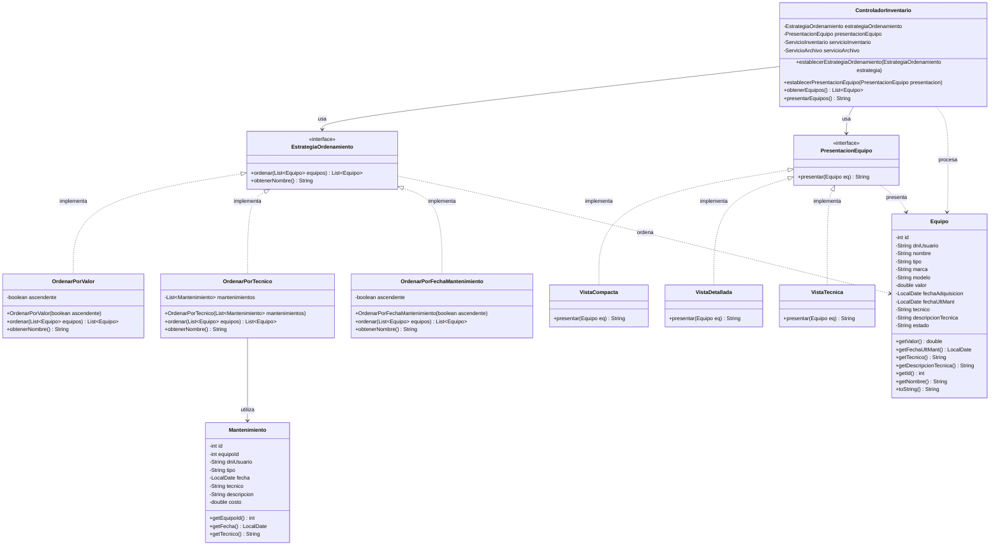

# Diagrama de Clases UML - Patrón Strategy

Este documento contiene el diagrama de clases UML del patrón Strategy implementado en el sistema de inventario.

## Diagrama en formato Mermaid



## Descripción del Patrón Strategy

### Componentes Principales

#### 1. Estrategias de Ordenamiento

**EstrategiaOrdenamiento (Interfaz)**
- Define el contrato para todas las estrategias de ordenamiento
- Métodos: `ordenar(List<Equipo> equipos)` y `obtenerNombre()`

**OrdenarPorValor (Implementación Concreta)**
- Ordena equipos por su valor económico
- Soporta orden ascendente y descendente
- Atributo: `boolean ascendente`

**OrdenarPorTecnico (Implementación Concreta)**
- Ordena equipos por el técnico del último mantenimiento
- Utiliza la lista de mantenimientos para obtener el técnico
- Los equipos sin mantenimiento aparecen al final

**OrdenarPorFechaMantenimiento (Implementación Concreta)**
- Ordena equipos por la fecha del último mantenimiento
- Soporta orden ascendente (más antiguo primero) y descendente (más reciente primero)
- Maneja valores nulos colocándolos al final

#### 2. Estrategias de Presentación

**PresentacionEquipo (Interfaz)**
- Define el contrato para todas las estrategias de presentación
- Método: `presentar(Equipo eq)`

**VistaCompacta (Implementación Concreta)**
- Muestra solo el nombre del equipo
- Formato mínimo para listas rápidas

**VistaDetallada (Implementación Concreta)**
- Muestra toda la información del equipo
- Utiliza el método `toString()` del equipo

**VistaTecnica (Implementación Concreta)**
- Muestra información técnica relevante
- Incluye: nombre, técnico, valor y descripción técnica
- Formato: `"Nombre | Técnico | S/. Valor | Descripción"`

#### 3. Contexto (ControladorInventario)

**ControladorInventario (Clase Contexto)**
- Mantiene referencias a las estrategias actuales
- Permite cambiar dinámicamente las estrategias en tiempo de ejecución
- Utiliza las estrategias para procesar equipos según la configuración del usuario

### Flujo de Funcionamiento

1. **Configuración de Estrategias:**
   - El usuario selecciona una estrategia de ordenamiento y/o presentación desde la interfaz
   - La vista llama a `ControladorInventario.establecerEstrategiaOrdenamiento()` o `establecerPresentacionEquipo()`
   - El controlador almacena la referencia a la estrategia seleccionada

2. **Aplicación de Estrategias:**
   - Cuando se solicitan los equipos, el controlador llama a `obtenerEquipos()`
   - Si hay una estrategia de ordenamiento configurada, se aplica antes de retornar la lista
   - Cuando se presenta la información, se usa la estrategia de presentación para formatear cada equipo

3. **Cambio Dinámico:**
   - Las estrategias pueden cambiarse en cualquier momento sin modificar el código del controlador
   - Esto permite flexibilidad y extensibilidad del sistema

### Ventajas del Patrón

- **Flexibilidad**: Fácil agregar nuevas estrategias sin modificar código existente
- **Separación de Responsabilidades**: Cada estrategia encapsula su lógica específica
- **Intercambiabilidad**: Las estrategias pueden cambiarse dinámicamente en tiempo de ejecución
- **Reutilización**: Las estrategias pueden reutilizarse en diferentes contextos
- **Mantenibilidad**: Cambios en una estrategia no afectan a las demás

### Ejemplo de Uso

```java
// Configurar estrategia de ordenamiento
ControladorInventario controlador = new ControladorInventario(servicio);
controlador.establecerEstrategiaOrdenamiento(new OrdenarPorValor(true));

// Configurar estrategia de presentación
controlador.establecerPresentacionEquipo(new VistaTecnica());

// Obtener equipos ordenados
List<Equipo> equipos = controlador.obtenerEquipos();

// Presentar equipos con formato técnico
String presentacion = controlador.presentarEquipos();
```
