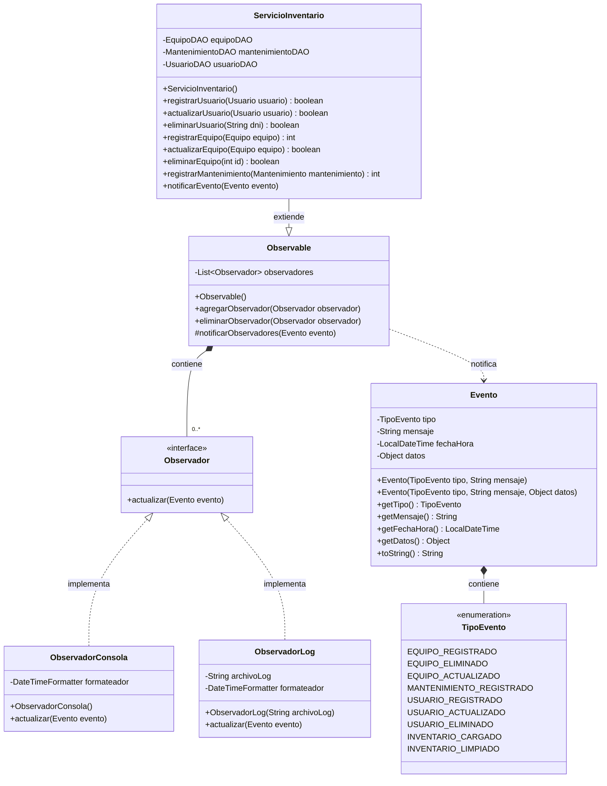

# Diagrama de Clases UML - Patrón Observer

Este documento contiene el diagrama de clases UML del patrón Observer implementado en el sistema de inventario.

## Diagrama en formato Mermaid

## Descripción del Patrón Observer

### Componentes Principales

1. **Observable (Clase Base)**
   - Gestiona una lista de observadores
   - Proporciona métodos para agregar y eliminar observadores
   - Notifica a todos los observadores cuando ocurre un evento

2. **Observador (Interfaz)**
   - Define el contrato que deben implementar todos los observadores
   - Método `actualizar(Evento evento)` que se invoca cuando hay un cambio

3. **Evento (Clase)**
   - Encapsula la información del evento notificado
   - Contiene tipo de evento, mensaje, fecha/hora y datos opcionales
   - Incluye un enum `TipoEvento` con todos los tipos de eventos posibles

4. **ObservadorConsola (Implementación Concreta)**
   - Muestra los eventos en la consola con formato específico
   - Utiliza un formateador de fecha para mostrar la hora

5. **ObservadorLog (Implementación Concreta)**
   - Registra los eventos en un archivo de log
   - Utiliza un formateador de fecha completo (fecha y hora)

6. **ServicioInventario (Observable Concreto)**
   - Extiende `Observable` para poder notificar eventos
   - Notifica eventos cuando se registran, actualizan o eliminan equipos, usuarios y mantenimientos

### Flujo de Funcionamiento

1. `ServicioInventario` (que extiende `Observable`) realiza una operación (ej: registrar un equipo)
2. Crea un objeto `Evento` con la información relevante
3. Llama a `notificarObservadores(Evento evento)` (heredado de `Observable`)
4. `Observable` itera sobre todos los observadores registrados
5. Cada observador recibe la notificación mediante `actualizar(Evento evento)`
6. Cada observador procesa el evento según su implementación (consola o archivo)

### Ventajas del Patrón

- **Desacoplamiento**: El sujeto observable no conoce los detalles de los observadores
- **Extensibilidad**: Fácil agregar nuevos tipos de observadores sin modificar el código existente
- **Reutilización**: El código de notificación está centralizado en la clase `Observable`
